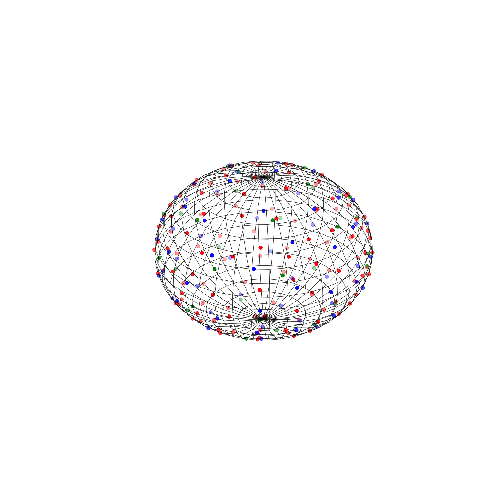

These scripts can be used to draw spheres and points on a sphere.

Random points on a sphere.
points_on_sphere.py

Equally distance points on a sphere.
points_on_sphere_distance.py

The points that are too close to other points are discarded.

this is the same figure as a gif

In this figure I plotted the discarded points in blue.

It is also possible to draw set of points with different colours

You can also remove the axis or the wireframe of the sphere

without the wireframe

without the axis

without the axis and frame

