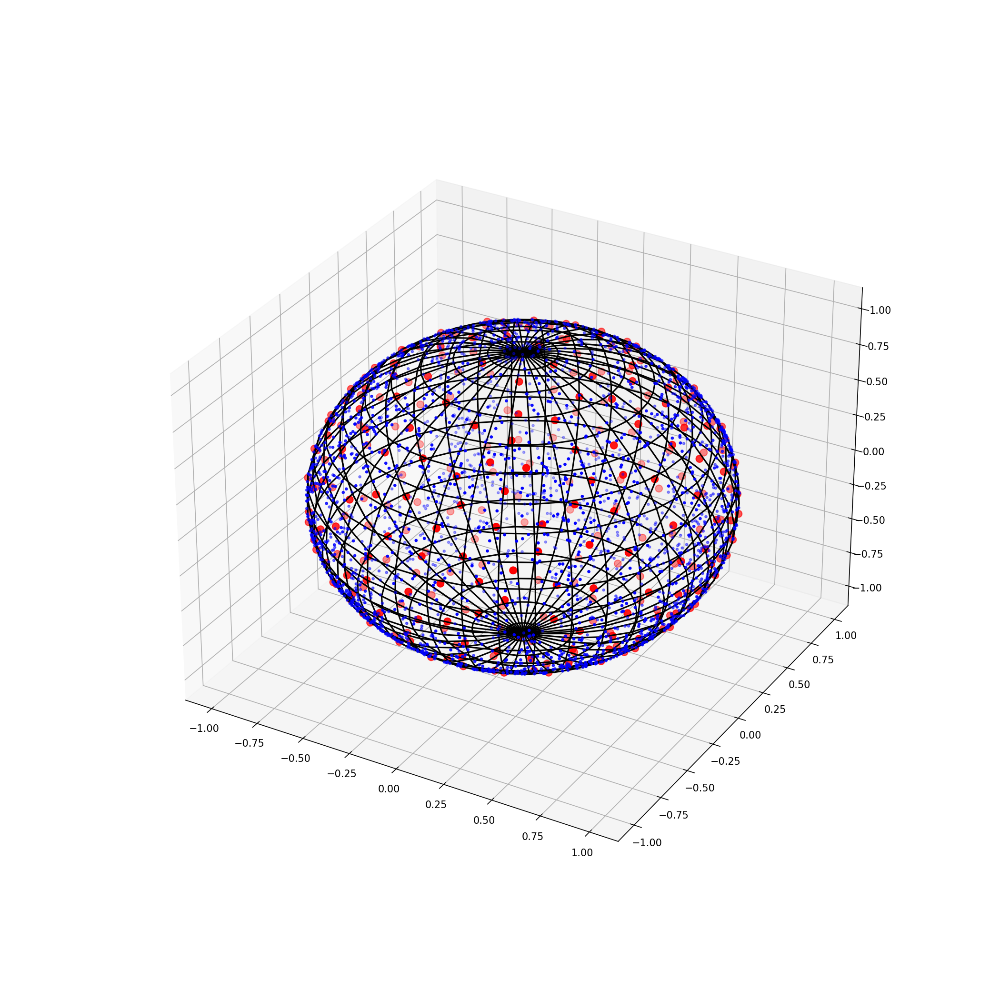

These scripts can be used to draw spheres and points on a sphere.

Random points on a sphere.
points_on_sphere.py

Equally distance points on a sphere.
points_on_sphere_distance.py

The points that are too close to other points are discarded.

this is the same figure as a gif

In this figure I plotted the discarded points in blue.

without the wireframe

